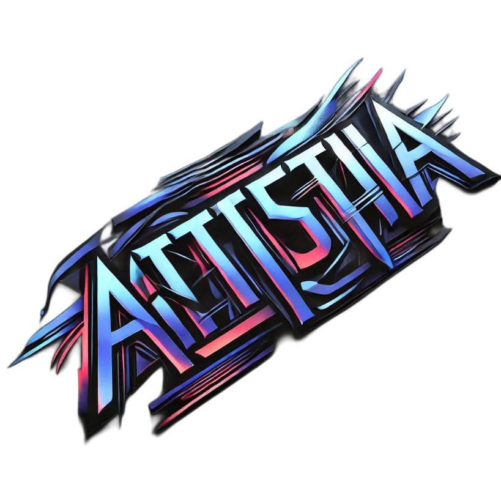

  

## Overview
**Athestia** is an innovative application built on Named Data Networking (NDN) integrated with Dilithium post-quantum cryptography to enhance security in future internet infrastructures.

## Problem Statement
The current TCP/IP network model relies on repetitive data requests from users, leading to increased server load and higher latency. This inefficiency worsens with the rise of quantum computing, which threatens traditional cryptographic algorithms like RSA and ECC. These algorithms are becoming vulnerable, necessitating the shift towards more secure cryptographic solutions.

## Solution
Athestia leverages **Named Data Networking (NDN)**, where data caching at routers minimizes server load and accelerates data retrieval. To address the security vulnerabilities of NDN, which currently employs RSA for digital signatures, we integrate **Dilithium**, a post-quantum cryptographic algorithm recognized by NIST for its resistance to quantum attacks. 

We will develop a **Dilithium accelerator** responsible for key generation, digital signatures, and verification. This ensures that data remains self-certified, safeguarding authenticity, integrity, and supporting non-repudiation. 

Our implementation will be demonstrated on a **miniNDN topology**, showcasing the improvements in server load, data retrieval, and secure communication.

## Algorithms
- **Key Generation**: Generates public and private key pairs for secure communication.
- **Signature**: Uses the private key to sign messages and the public key to verify the signature's authenticity.
- **Verification**: Utilizes the public key to confirm the authenticity of the digital signature.
